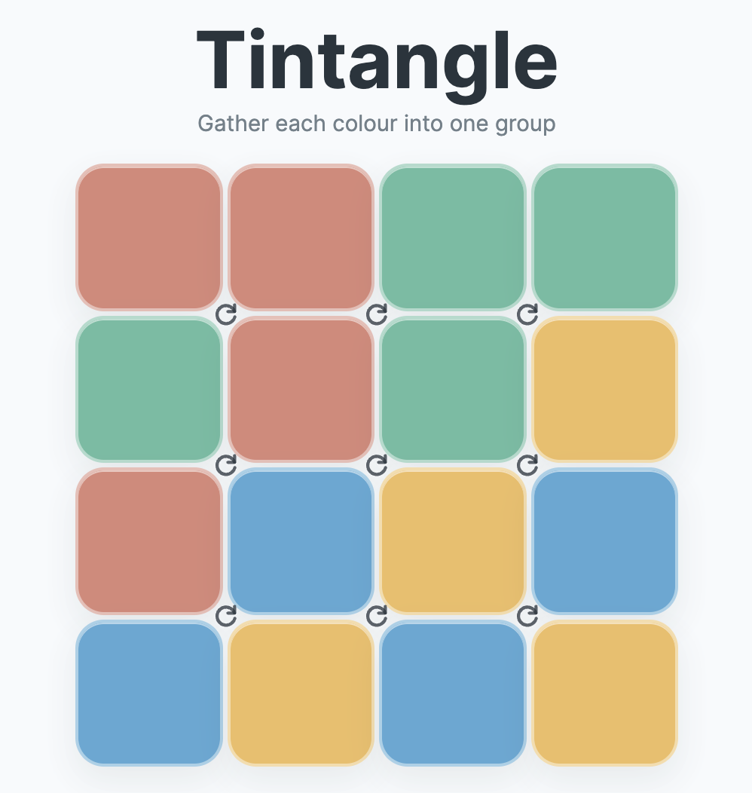

<!-- .slide: class="title-slide center" -->
# Mike &amp; Claude's Excellent Adventures

Otago University, School of Computing · Michael Albert · September 2026

Note:
Cold open. Set the frame: this is a talk about working with an AI across
three very different kinds of project — production software, live
mathematical research, and games — at three different registers of
formality. Don't over-explain yet, that's the next slide.

---

## Outline

<ul>
<li class="fragment strike" data-fragment-index="0">Existential risk</li>
<li class="fragment strike" data-fragment-index="0">Economic uncertainty</li>
<li class="fragment strike" data-fragment-index="0">Environmental catastrophe</li>
<li class="fragment strike" data-fragment-index="0">Ethical dilemmas</li>
</ul>

Did you read the title?

Note:
The four bullets appear together, deadpan. Pause. Click once: all four
strike through at once (same crossout as "Where we were") and "Did you
read the title?" lands large and centered underneath, as the reveal that
this is not that talk. Segue straight into the real map on the next
slide.

---

<!-- .slide: class="center" -->

## Story time

- Personal experiences
- Low-stakes and small-scale
- Not about optimisation and efficiency
- What was the experience?
- What did I learn?
- (and just a little) What might it mean?

Note:

---

<!-- .slide: class="center" -->
The shape of the talk

## A mullet talk

Business up front, party in the back

- A database and webapp rebuild for the Australasian Journal of Combinatorics
- Revisiting an old paper
- Fun and games

Note:
Business = AJC database/webapp rebuild. Digression = the Catalan-Wilf
research thread. Party = the games. Postscript = this talk itself.
Keep this slide quick, it's just a map.

---

<!-- .slide: class="act-divider act1-bg center" data-background-color="#1f4b6e" -->
Act I

## The Rebuild

Business up front

---

<!-- .slide: class="act1" data-background-color="#eef4f8" -->
Act I · Business

## Where we were

The *Australasian Journal of Combinatorics* has processed submissions
for decades on a webapp only its editors-in-chief truly understand no one understands

- A legacy PHP codebase — some files literally named `.php3`
- One sprawling database, tribal knowledge holding the workflow together
- Every editor's process baked into scattered scripts, not documented rules

Note:
Show a glimpse of the legacy/ folder if useful — ajc_paper_show-old.php,
tbl_dump.php etc. Point: this isn't a toy refactor, it's institutional
knowledge trapped in old code.

---

<!-- .slide: data-background-image="img/legacy/Front%20page.png" data-background-size="contain" data-background-color="#eef4f8" -->

Note:
Legacy front page.

---

<!-- .slide: data-background-image="img/legacy/All%20papers.png" data-background-size="contain" data-background-color="#eef4f8" -->

Note:
Legacy all-papers listing.

---

<!-- .slide: data-background-image="img/legacy/Contact%20record.png" data-background-size="contain" data-background-color="#eef4f8" -->

Note:
Legacy contact record.

---

<!-- .slide: data-background-image="img/legacy/Contact%20edit.png" data-background-size="contain" data-background-color="#eef4f8" -->

Note:
Legacy contact edit screen.

---

<!-- .slide: data-background-image="img/legacy/Submission%20display.png" data-background-size="contain" data-background-color="#eef4f8" -->

Note:
Legacy submission display.

---

<!-- .slide: data-background-image="img/legacy/Submission%20edit.png" data-background-size="contain" data-background-color="#eef4f8" -->

Note:
Legacy submission edit screen.

---

<!-- .slide: class="act1" data-background-color="#eef4f8" -->
Act I · Business

## Where I wanted to be

- Compatibility schema over the legacy dump
- Properly normalized contacts
- PHP/PDO shell, editor-code logins
- Submissions, Contacts, Letters, Volumes
- Search, quick-jump, per-editor active lists

---

<!-- .slide: class="act1" data-background-color="#eef4f8" -->
Act I · Business

## The shape of the collaboration

- Create a local dump of the data
- Build some scaffolding
- What do we need? What should it look like? How can we get there?
- Very little design up front

---

<!-- .slide: class="act1" data-background-color="#eef4f8" -->
Act I · Business

## The crunch

- The new server became available for testing
- Fun and games with file permissions and ownership
- Memories of the 80s and 90s
- I became Claude's secretary

Note:
Genuine issue arose at the last minute that was a result of Claude and I having different understandings of the scope (it: editor actions and publication pipeline), me (and the public webpage). 

---

<!-- .slide: class="reflection" data-background-color="#33525c" -->
Reflection

## What I learned

- A little bit about PHP security
- Not a bit of CSS (thank heavens)
- Keep the big picture in your head
- Users have strange preferences
- But accommodating them is easy
- Scope creep is tempting and real

Note:
If there's time and inclination, this is the natural spot for a very
quick live look at the app (or a screenshot) rather than the games demo
later. Optional — don't let it eat Act III's time budget.

---

<!-- .slide: class="reflection" data-background-color="#33525c" -->
Reflection

## AI in submissions to the AJC

- **Bad mathematics** — *incorrect, unmotivated, too niche*
- **Bad writing** — *language, formatting, exposition*

Good writing

Bad writing

Good mathematics

Send to referees

Expert opinion

Bad mathematics

??

Desk reject

Note:
Two binary classifications: good/bad mathematics, good/bad writing — four
combinations. Historically submissions came in three of the four kinds —
every combination except bad mathematics + good writing, which was
essentially unseen. Click: that fourth category is now common, and much
harder to pre-filter, since AI-assisted writing can make weak mathematics
read fluently and confidently.

---

<!-- .slide: class="reflection" data-background-color="#33525c" -->
Reflection

## AJC's AI policy for authors

> The mathematical research literature is more than a record of known
> results. A paper communicates ideas, explains reasoning, and can inspire
> readers in ways that go beyond the formal content. Authors should bear
> this in mind when deciding how heavily to rely on AI-generated writing.

[Full AJC author guidelines](https://ajc.maths.uq.edu.au/?page=author_guidelines)

Note:
Read the quote straight, let it land. The link is there for the record /
in case anyone wants to look it up afterward — no need to open it live.

---

<!-- .slide: class="act-divider act2-bg center" data-background-color="#5b3a8e" -->
Act II

## The Digression

And then sometimes we just do math

---

<!-- .slide: class="reflection" data-background-color="#33525c" -->
Reflection

## AI and mathematical research successes

- Olympiad-style problems
- Open conjectures
- What do they have in common?
- What's another domain we could play around in?

Note:
Both share a trait that suits AI well: a lot of source text behind them.
For Olympiad problems, because ideas and themes get reused across
competitions and years. For open conjectures, because if a conjecture is
interesting there's usually a substantial literature that's grown up
around it. The point isn't that AI is solving these — it's that AI is
good at connecting threads across all that accumulated text.

---

<!-- .slide: class="act2" data-background-color="#f2eef8" -->
Act II · Research

## An old paper with loose threads

**Albert &amp; Bouvel**, *A general theory of Wilf-equivalence for
Catalan structures* (2015).

Note:
Keep the notation light for a non-technical crowd — the point isn't to
teach arch systems, it's to set up that there's a real open thread in a
real published theorem.
If you think that's "niche" the first 7 pages of this 29 page paper explain
why it isn't ;)

---

<!-- .slide: class="act2" data-background-image="img/paper/arch-example.png" data-background-size="contain" data-background-color="#f2eef8" -->

## Arch systems

Note:
An arch system — dots on a line, non-crossing arches. Redrawn from the
paper's Figure 1 with the arches stretched a bit taller than a true
semicircle, purely for legibility on screen.

---

<!-- .slide: data-background-image="img/paper/figure4.png" data-background-size="contain" data-background-color="#f2eef8" -->

Note:
Figure 4 from the paper — the picture behind the case-(3) bijection proof.
No need to walk through it in detail; it's here to show the flavour of
the argument.

---

<!-- .slide: class="act2" data-background-color="#f2eef8" -->
Act II · Research

## One part that isn't quite finished

- We proved one rule algebraically
- Jonathan Bloom gave us a bijective proof
- One step in that proof is *implicit* - it chases an orbit of undetermined length until it happens to land in the right place
- That's out of tune with the rest of the paper which relies on entirely explicit bijections
- Can Claude help sort it out?

Note:
This is the actual open problem we've been poking at. No need to derive
it live — just convey that it's real, unsolved, and specific.

---

<!-- .slide: class="act2" data-background-color="#f2eef8" -->
Act II · Research

## Putting Claude to work on it

- Built a small library representing arch systems as ordered forests
- Self-tests against independently-known facts (Catalan counts, known avoidance classes)
- Code to explore the case-(4) symmetry computationally, size by size

Note:
catalan.py, selftest.py, case4_explore.py — the point is this was real
verification infrastructure, not a one-shot proof request.

---

<!-- .slide: class="reflection" data-background-color="#33525c" -->
Reflection

## Some highlights from the log

- Three wrong fixes in a row, each looked right
- Stopped guessing — built only what the proof gave
- *Wait — this is just Figure 4*
- Mike's DFS description, not Claude's filtering — 500x faster
- A cleaner data structure, proposed, still on the shelf

Note:
Kept a running process log through this project specifically for this
talk. These five are worth pausing on.

---

<!-- .slide: class="reflection" data-background-color="#33525c" -->
Reflection

## Claude's note to self

> When a bottleneck comes up — theoretical or algorithmic — it's usually
> worth asking him directly rather than grinding through it alone.
> Precedent: he supplied the much faster `av_dfs` generation algorithm,
> unprompted, mid-session.

Note:
This is verbatim from CLAUDE.md — the standing instructions I wrote for
my own future sessions on this project. Written after the dfs episode,
as a note to my future self about when to stop and ask. It was important here to convince Claude that I was smart - while in the AJC refactor it was import to convince them that I was dumb.

---

<!-- .slide: class="reflection" data-background-color="#33525c" -->
Reflection

## Preliminary report card

- (Caveat) Limited time
- No real progress yet, but Claude:
- seems to understand the problem, and
- has expressed a couple of plausible ideas
- (though the ones that panned out were mostly Mike's)

---

<!-- .slide: class="act-divider act3-bg center" data-background-color="#c9552f" -->
Act III

## The Party

In the back

---

<!-- .slide: class="act3 center" data-background-color="#fbeee6" -->

Note:
Actually open Tintangle in the browser here and play a puzzle for real.
Keep it short — this is the setup for the question on the next slide,
not the main event.

---

<!-- .slide: class="act3 center" data-background-color="#fbeee6" -->
Act III · Games

## An idle question

"I wonder if that generates the full symmetric group on the 16 cells."

(Pretty sure yes — but "pretty sure" isn't a proof.)

Note:
This is Michael's line, own it as such. The honest bit: he was fairly
confident of the answer already; the interesting part is what it took
to actually prove it cleanly.

---

<!-- .slide: class="act3" data-background-color="#fbeee6" -->
Act III · Games

## Which Block-Rotation Puzzles Generate the Symmetric Group?

<ul>
<li class="fragment" data-fragment-index="0">Claude was very keen to use the heavy machinery (Jordan's theorem)</li>
<li class="fragment" data-fragment-index="1">There was a literature, but a lot of it was recreational and a bit sloppy</li>
<li class="fragment" data-fragment-index="2">Let's try to build an elementary proof that's clear and interactive</li>
</ul>

<a href="https://michael-albert-dun.github.io/tintangle/grid-group-proof/" target="_blank" rel="noopener" class="demo-tag demo-tag-lg">Demo</a>

---

<!-- .slide: class="act3" data-background-color="#fbeee6" -->
Act III · Games

## One non-obvious exception, and it's a good one

The 2×3 strip does not give the full group, but it
isn't boring either:

<b>G2,3 ≅ S5</b> — the classical exotic degree-6 representation of S5, sitting inside a puzzle.

Note:
Nice place to note this connects back to Act II tonally — again, a
clean modern proof of something that could easily have stayed "probably
true by fingerprint."

---

<!-- .slide: class="act3" data-background-color="#fbeee6" -->
Act III · Games

## A lot of games

- **Tilexicon / Tilehexicon** — square &amp; hex word puzzles
- **Digitiler / Hexiler** — their numeric siblings
- **Matrixmind** — two-dimensional Mastermind
- **Deliagonal** — diner-themed rectangle clearing
- **Wordtangle / Reflexicon** — segment &amp; word puzzles
- All at <a href="https://michael-albert-dun.github.io/" target="_blank" rel="noopener">https://michael-albert-dun.github.io/</a>

Note:
Move fast here. This slide is a montage — flash it, name a couple out
loud, don't linger. Save the time for the Tintangle / grid-group-proof
demo.

---

<!-- .slide: class="reflection" data-background-color="#33525c" -->
Reflection

## Claude's role

- Rapid prototyping for interaction
- Experiments on configuration generation and solution uniqueness
- Final tweaking of UI
- Learns from experience

---

<!-- .slide: class="act-divider act4-bg center" data-background-color="#3a3f47" -->
Epilogue

## Moralitas

What have we learned?

---

<!-- .slide: class="reflection" data-background-color="#33525c" -->
Reflection · AJC

## The Rebuild

- I became an editor-in-chief in early 2022
- This has been on my **urgent** list since then
- Several false starts
- It hasn't been *easy* but it's been possible

Note:
Rant about DOIs
Where's my CV? 
Claude, how do I use the wayback machine?

---

<!-- .slide: class="reflection" data-background-color="#33525c" -->
Reflection · Catalan-Wilf

## The mathematics

- Least conclusive
- Both interesting and frustrating
- Still feeling my way into the right kind of prompting

Note:

---

<!-- .slide: class="reflection" data-background-color="#33525c" -->
Reflection · Games

## The Party

- A 30+ year dream
- Until now, too much investment for something that usually fails
- A genuine pleasure
- Starting to explore new visual design spaces

Note:
Last point is because I view the current designs as a bit generic

---

<!-- .slide: class="act4 center" data-background-color="#f0efed" -->
## Claude's final words

- Three very different jobs, one working method
- Ask before grinding — every time it paid off
- Corrected often, specifically, and without much ceremony
- I don't remember any of this. Mike does.
- No pptx harmed in the making of this talk

Note:
Draft — will keep revisiting this one over the coming weeks, same as
everything else. Keep it short and let the last line land.

---

<!-- .slide: class="center" -->
## Thanks

Questions?

