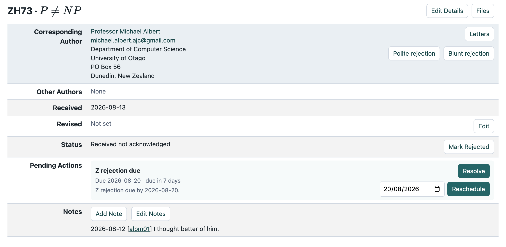
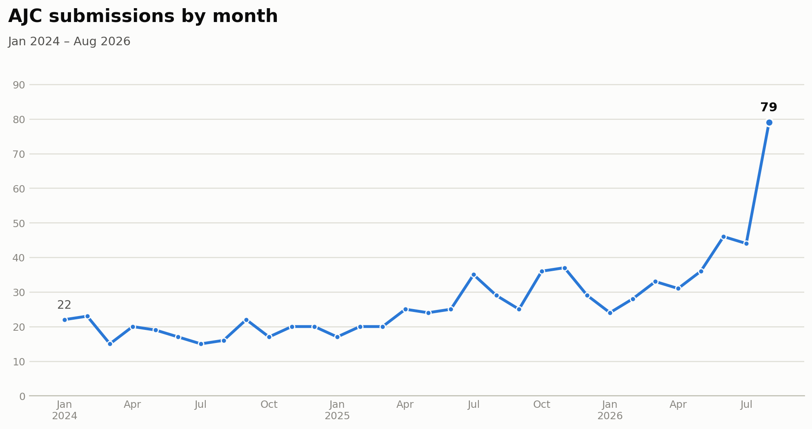

<!-- .slide: class="title-slide center" -->
# Mike &amp; Claude's Excellent Adventures

Otago University School of Computing · Michael Albert · September 2026

Note:
Cold open. Set the frame: this is a talk about working with an AI across
two very different kinds of project — production software and games —
at two different registers of formality. Don't over-explain yet, that's
the next slide.

---

## AI in 2026

<ul>
<li class="fragment strike" data-fragment-index="0">Existential Endgame</li>
<li class="fragment strike" data-fragment-index="0">Economic Erosion</li>
<li class="fragment strike" data-fragment-index="0">Environmental Emergency</li>
<li class="fragment strike" data-fragment-index="0">Ethical Enigmas</li>
<li class="fragment strike" data-fragment-index="0">Enlightening Encyclical</li>
</ul>

Did you read the title?

Note:
The four bullets appear together, deadpan. Pause. Click once: all four
strike through at once (same crossout as "Where we were") and "Did you
read the title?" lands large and centered underneath, as the reveal that
this is not that talk. Segue straight into the real map on the next
slide.

---

<!-- .slide: class="center" -->

## Story time

- Personal experiences
- Low-stakes and small-scale
- Not about optimisation and efficiency
- What was the experience?
- What did I learn?
- (and just a little) What might it mean?

Note:

---

<!-- .slide: class="center" -->
The shape of the talk

## A mullet talk

<em>Business up front, party in the back</em>

- A database and webapp rebuild for the Australasian Journal of Combinatorics
- Fun and games

Note:
Business = AJC database/webapp rebuild. Party = the games. Epilogue =
this talk itself. Keep this slide quick, it's just a map.

---

<!-- .slide: class="act-divider act1-bg center" data-background-color="#1f4b6e" -->
Act I

## The Rebuild

Business up front

---

<!-- .slide: class="act1" data-background-color="#eef4f8" -->
Act I · Business

## Where we were

The *Australasian Journal of Combinatorics* has processed submissions
for decades on a webapp only its editors-in-chief truly understand no one understands

- A legacy PHP codebase — some files literally named `.php3`
- One sprawling database, tribal knowledge holding the workflow together
- Every editor's process baked into scattered scripts, not documented rules

Note:
Show a glimpse of the legacy/ folder if useful — ajc_paper_show-old.php,
tbl_dump.php etc. Point: this isn't a toy refactor, it's institutional
knowledge trapped in old code.

---

<!-- .slide: data-background-image="img/legacy/Front%20page.png" data-background-size="contain" data-background-color="#eef4f8" -->

Note:
Legacy front page.

---

<!-- .slide: data-background-image="img/legacy/Contact%20record.png" data-background-size="contain" data-background-color="#eef4f8" -->

Note:
Legacy contact record.

---

<!-- .slide: data-background-image="img/legacy/Submission%20display.png" data-background-size="contain" data-background-color="#eef4f8" -->

Note:
Legacy submission display.

---

<!-- .slide: data-background-image="img/legacy/Submission%20edit.png" data-background-size="contain" data-background-color="#eef4f8" -->

Note:
Legacy submission edit screen.

---

<!-- .slide: class="act1" data-background-color="#eef4f8" -->
Act I · Business

## Back in the future

- It's the 2020s, not the 1990s
- Make everyday tasks easy
- Don't add friction or rigidity
- Every action recorded, not just remembered
- The next me, or their Claude-equivalent, should be able to pick it up seamlessly

Note:
"Recorded" = the structured audit trail/notes; "documented" covers both
that internal record-keeping and the external docs (architecture,
schema, workflows) meant to outlive this specific rewrite.

---

<!-- .slide: class="act1" data-background-color="#eef4f8" -->
Act I · Business

## The shape of the collaboration

- Create a local dump of the data
- Build some scaffolding
- What do we need? What should it look like? How can we get there?
- Very little design up front

---

<!-- .slide: class="act1" data-background-color="#eef4f8" -->
Act I · Business

## The crunch

- The new server became available for testing
- Fun and games with file permissions and ownership
- Back to the 80s!
- I became Claude's secretary

Note:
Genuine issue arose at the last minute that was a result of Claude and I having different understandings of the scope (it: editor actions and publication pipeline), me (and the public webpage). Amusing "bug" - I thought quick-hint was providing only 5 hits (when it should have been 8). In fact the quick-hint box was scrollable. Roughly 30 minutes wasted trying to figure out more and more odd reasons it could be happening.
Tar, double hop scp, ....

---

<!-- .slide: class="act1" data-background-color="#eef4f8" -->
Act I · Business

## The data? I can't handle the data!

<ul>
<li class="fragment" data-fragment-index="0">New app: ~16k lines across 77 files</li>
<li class="fragment" data-fragment-index="1">Legacy: ~20k lines across 148 files</li>
<li class="fragment" data-fragment-index="2">Live database: 23 tables, ~23MB, 5,298 submissions, 9,524 contacts</li>
<li class="fragment" data-fragment-index="3">165 commits over about 12 weeks</li>
</ul>

Roughly 20% smaller than the legacy system — while doing (a lot) more.

Note:
Ballpark figures — wc -l / information_schema, not cloc, so good enough
for order of magnitude, not exact. Worth a laugh: the legacy tree also
carries a bundled phpMyAdmin install nobody asked for, 242 files and
66,517 lines, not even AJC's own code — excluded from the legacy count
above to keep the comparison fair. The "more" in the callout: structured
audit trail/notes, public landing pages with MathJax, automated volume
tracking — none of which the legacy system had.

---

<!-- .slide: class="reflection" data-background-color="#33525c" -->
Reflection

## What I learned

- A bit about PHP security (which I've forgotten)
- Not a bit of CSS (thank heavens)
- Keep the big picture in your head
- Users have strange preferences
- But accommodating them is easy
- Scope creep is tempting and real

Note:
If there's time and inclination, this is the natural spot for a very
quick live look at the app (or a screenshot) rather than the games demo
later. Optional — don't let it eat Act II's time budget.

---

<!-- .slide: class="act1 center" data-background-color="#eef4f8" -->
Act I · Business

## My greatest accomplishment

Note:
Self-submitted a P≠NP paper to my own journal, then rejected it myself
("I thought better of him"). Let the room read it — no need to narrate
the screenshot line by line. Click: circle the Polite/Blunt rejection
buttons — the actual punchline.

---

<!-- .slide: class="reflection" data-background-color="#33525c" -->
Reflection

## AI in submissions to the AJC

- **Bad mathematics** — *incorrect, unmotivated, too niche*
- **Bad writing** — *language, formatting, exposition*

Good writing

Bad writing

Good mathematics

Send to referees

Expert opinion

Bad mathematics

??

Desk reject

Note:
Two binary classifications: good/bad mathematics, good/bad writing — four
combinations. Historically submissions came in three of the four kinds —
every combination except bad mathematics + good writing, which was
essentially unseen. Click: that fourth category is now common, and much
harder to pre-filter, since AI-assisted writing can make weak mathematics
read fluently and confidently.

---

<!-- .slide: class="reflection" data-background-color="#33525c" -->
Reflection

## AJC's AI policy for authors

> The mathematical research literature is more than a record of known
> results. A paper communicates ideas, explains reasoning, and can inspire
> readers in ways that go beyond the formal content. Authors should bear
> this in mind when deciding how heavily to rely on AI-generated writing.

[Full AJC author guidelines](https://ajc.maths.uq.edu.au/?page=author_guidelines)

Note:
Read the quote straight, let it land. The link is there for the record /
in case anyone wants to look it up afterward — no need to open it live.

---

<!-- .slide: class="act1 center" data-background-color="#eef4f8" -->
Act I · Business

## A looming crisis?

Note:
Submissions have roughly tripled since the AI-writing surge discussed
earlier — 79 last month against a 22-46 range for most of the last two
and a half years. Genuinely unclear yet whether this settles into a new
normal or keeps climbing; the question mark in the title is doing real
work.

---

<!-- .slide: class="act-divider act3-bg center" data-background-color="#c9552f" -->
Act II

## The Party

In the back

---

<!-- .slide: class="act3" data-background-color="#fbeee6" -->
Act II · Games

## A lot of games

- **<a href="https://michael-albert-dun.github.io/tilexicon/" target="_blank" rel="noopener">Tilexicon</a> / <a href="https://michael-albert-dun.github.io/tilehexicon/" target="_blank" rel="noopener">Tilehexicon</a>** — square &amp; hex word puzzles
- **<a href="https://michael-albert-dun.github.io/digitiler/" target="_blank" rel="noopener">Digitiler</a> / <a href="https://michael-albert-dun.github.io/hexiler/" target="_blank" rel="noopener">Hexiler</a>** — their numeric siblings
- **<a href="https://michael-albert-dun.github.io/matrixmind/" target="_blank" rel="noopener">Matrixmind</a>** — two-dimensional Mastermind
- **<a href="https://michael-albert-dun.github.io/deliagonal/" target="_blank" rel="noopener">Deliagonal</a>** — diner-themed rectangle clearing
- **<a href="https://michael-albert-dun.github.io/tintangle/wordtangle/" target="_blank" rel="noopener">Wordtangle</a> / <a href="https://michael-albert-dun.github.io/tintangle/reflexicon/" target="_blank" rel="noopener">Reflexicon</a>** — segment &amp; word puzzles
- All at <a href="https://michael-albert-dun.github.io/" target="_blank" rel="noopener">https://michael-albert-dun.github.io/</a>

Note:
Move fast here. This slide is a montage — flash it, name a couple out
loud, don't linger. Save the time for the three live demos next.

---

<!-- .slide: class="act3 center" data-background-color="#fbeee6" -->
Act II · Games

## Tilexicon

My first game in this suite.

<a href="https://michael-albert-dun.github.io/tilexicon/" target="_blank" rel="noopener" class="demo-tag demo-tag-lg">Demo</a>

Note:
Switch to the browser here and play/talk through it live — abandon the
deck for this bit. Come back for Deliagonal.

---

<!-- .slide: class="act3 center" data-background-color="#fbeee6" -->
Act II · Games

## Deliagonal

- A genuinely new mechanic (?)
- Trying to flex a bit in visual design

<a href="https://michael-albert-dun.github.io/deliagonal/" target="_blank" rel="noopener" class="demo-tag demo-tag-lg">Demo</a>

Note:
Live in the browser again. Come back for Tintangle.

---

<!-- .slide: class="reflection" data-background-color="#33525c" -->
Reflection

## Claude's role

- Rapid prototyping for interaction
- Experiments on configuration generation and solution uniqueness
- Final tweaking of UI
- Learns from experience - each game is a little easier to build than the last one

---

<!-- .slide: class="act-divider act4-bg center" data-background-color="#3a3f47" -->
Epilogue

## Morals

What have we learned?

---

<!-- .slide: class="reflection" data-background-color="#33525c" -->
Reflection · AJC

## The Rebuild

- I became an editor-in-chief in early 2022
- This has been on my **urgent** list since then
- Several false starts
- It hasn't been *easy* but it's been possible

Note:
Rant about DOIs
Where's my CV? 
Claude, how do I use the wayback machine?

---

<!-- .slide: class="reflection" data-background-color="#33525c" -->
Reflection · Games

## The Party

- A 30+ year dream
- Until now, too much investment for something that usually fails
- A genuine pleasure
- Starting to explore new visual design spaces
- And new creative outlets

Note:
Last point is because I view the current designs as a bit generic

---

<!-- .slide: class="reflection" data-background-color="#33525c" -->
Reflection · Use of AI

## Mike's final words

- Doing what you already do, just faster, is uninspired and potentially problematic
- But sometimes necessary
- If you can, search for dreams blocked only by mechanical obstacles

---

<!-- .slide: class="act4 center" data-background-color="#f0efed" -->
## Claude's final words

- Two very different jobs, one working method
- Ask before grinding — every time it paid off
- Corrected often, specifically, and without much ceremony
- I don't remember any of this. Mike does.
- No pptx harmed in the making of this talk

Note:
Draft — will keep revisiting this one over the coming weeks, same as
everything else. Keep it short and let the last line land.

---

<!-- .slide: class="center" -->
## Thanks

Questions?

